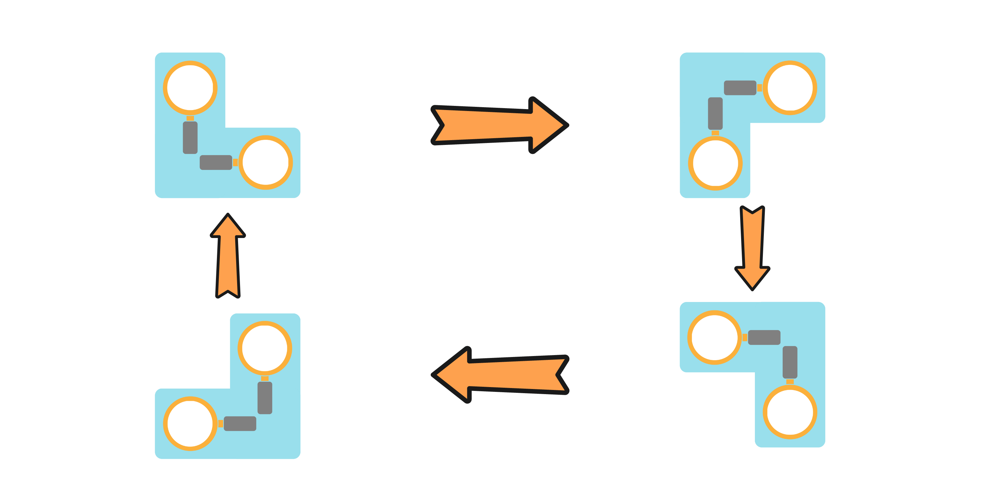
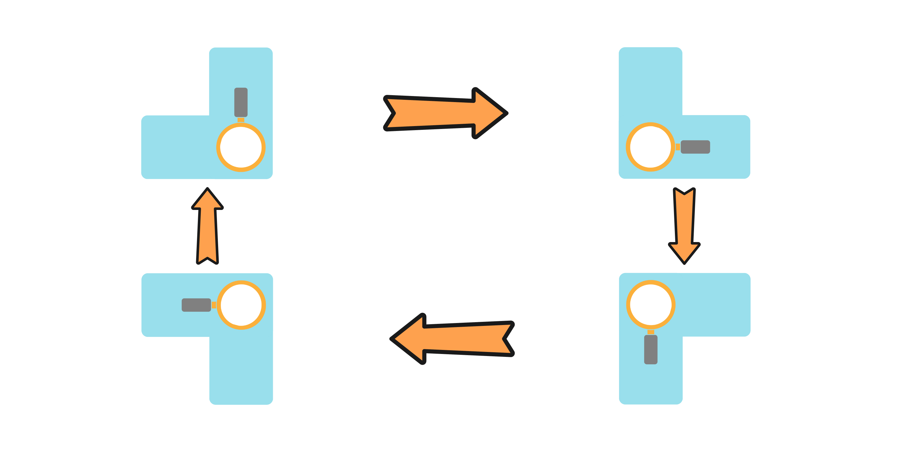
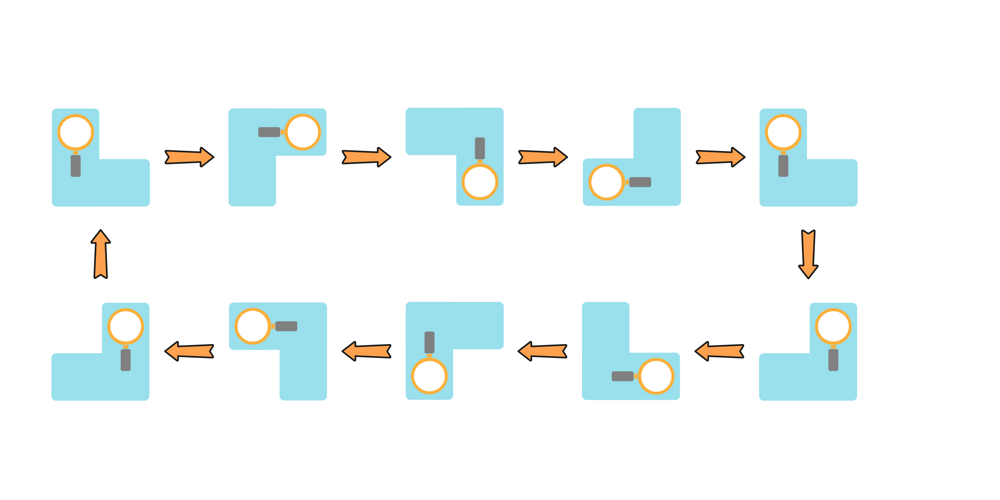
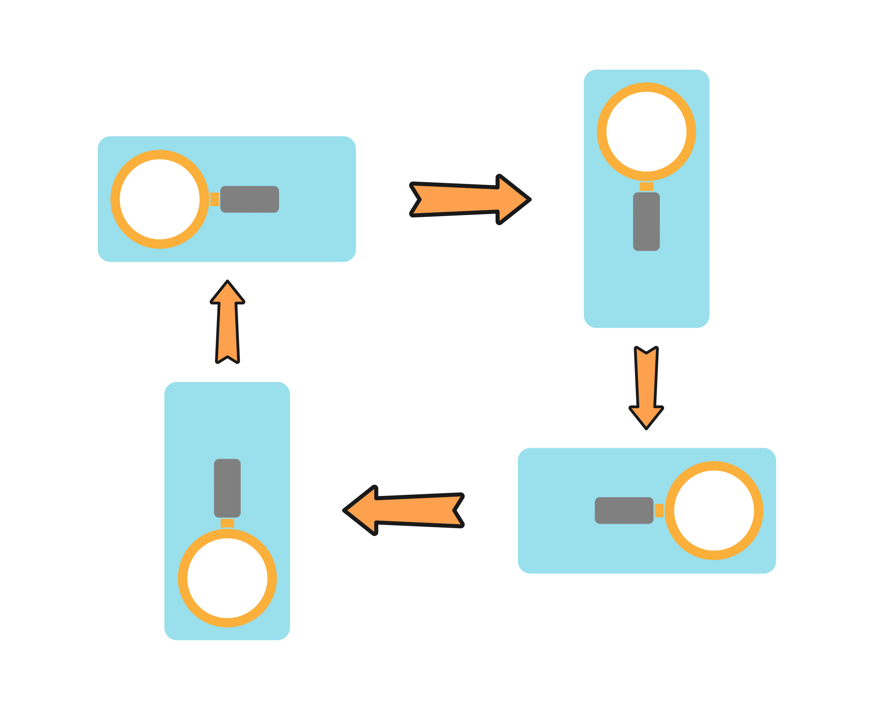
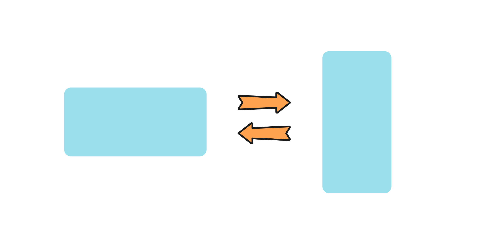

# 
 Catch Bug 

  

## 1. Giới thiệu

Catch bugs là một trò chơi thể loại trí tuệ, giải đố. Được HaiZuka lấy ý tưởng từ một lần xem trò chơi bắt ma trên tiktok  
Trò chơi rèn luyện cho người chơi tính tập trung, tư duy tưởng tưởng.
Trò chơi được hoàn thiện phiên bản đầu tiên vào ngày 21 tháng 02 năm 2023 với 36864 màn chơi.

## 2. Hướng dẫn chơi

### 2.1 Màn chơi

Mỗi màn chơi sẽ xếp hiện 6 con bọ trên bàn cờ và 6 mảnh ghép (Các mảnh ghép có thể xoay tuỳ ý khi người dùng bấm vào nó)  
Trên mảnh ghép sẽ có các kính lúp, nhiệm vụ của bạn là sắp xếp các mảnh ghép vào bàn cờ sao các kính lúp đều soi ra được bọ.  
Các mảnh ghép không được đè lên nhau.

### 2.2 Xoay các mảnh ghép

Các mảnh ghép trong trò chơi có quy luật biến đổi khi bấm vào như sau:

  

  

  

  

  

## 3. Góp ý

Trò chơi còn nhiều lỗi cũng như chưa được tối ưu về trải nghiệm của người dùng.  
Tôi mong nhận được góp ý của các bạn về trò chơi [Tại đây](https://github.com/zukahai/catch-bugs/issues/new)

# 
 Chúc các bạn chơi vui vẻ 

 

*Font chữ sử dụng trong trò chơi: **NVN verdana 8pt** cung cấp bởi [Font Việt Hoá NVN](https://www.facebook.com/NVNFONT)*
